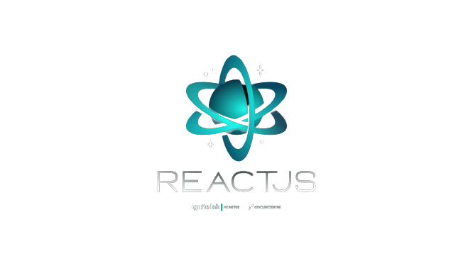
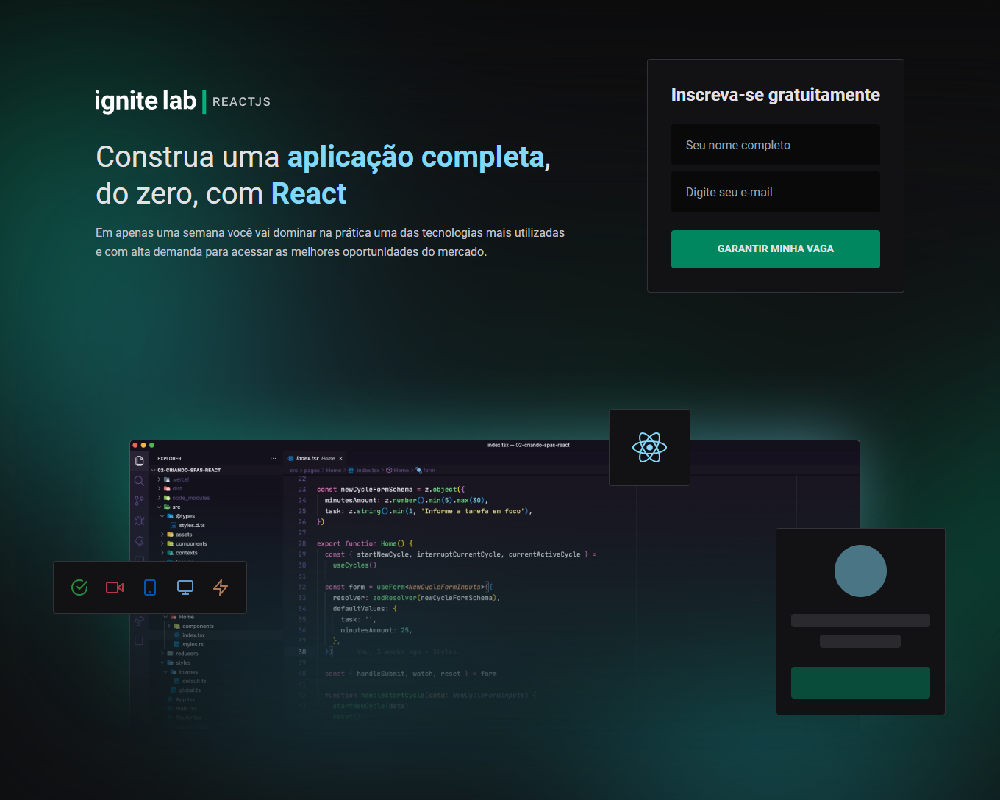

# Ignite-lab-react

<div align="center">


</div>

<div align="center">

<a href="#-Technologies
">Technologies</a>&nbsp;&nbsp;&nbsp;|&nbsp;&nbsp;&nbsp;
<a href="#-Screenshot">Screenshot</a>&nbsp;&nbsp;&nbsp;|&nbsp;&nbsp;&nbsp;
<a href="#-Getting started">Getting started</a>&nbsp;&nbsp;&nbsp;|&nbsp;&nbsp;&nbsp;
<a href="#-Contributing">Contributing</a>
&nbsp;&nbsp;&nbsp;|&nbsp;&nbsp;&nbsp;
<a href="#-Layout">Layout</a>

</div>

<div align="center">
  
</div>

🔥 Event platform developed during Ignite Lab event.

<br>

## 📸 Screenshot

<br>

<div align="center">

[](https://ignite-lab-react-ebon.vercel.app)

Click on the images above to see in production 👆

</div>

<br>

## 👾 Technologies

<br>

- [React](https://pt-br.reactjs.org/)
- [Graphql](https://graphql.org/)
- [TypeScript](https://www.typescriptlang.org/)
- [Vite](https://vitejs.dev/)
- [Date-fns](https://date-fns.org/)
- [Graphcms](https://graphcms.com/)
- [Apollo-client](https://www.apollographql.com/)
- [Phosphor-icons](https://phosphoricons.com/)
- [React-router-dom](https://v5.reactrouter.com/)
- [Tailwindcss](https://tailwindcss.com/)
- [Classnames](https://www.npmjs.com/package/classnames)

<br>

## ▶️ Getting started

<br>

⚠️ to run this project you must have installed [Git](https://git-scm.com) and [Npm](https://nodejs.org/en/) or [Yarn](https://yarnpkg.com/).

<br>

1. Clone this repo with:

```bash
$ git clone https://github.com/KaiqueMCR/NLW-return-impulse-server.git
```

2. Install all dependences with:

```bash
$ yarn
```

&nbsp;&nbsp;&nbsp;&nbsp;&nbsp;&nbsp; or

```bash
$ npm install
```

3. Run dev server with:

```bash
$ yarn dev
```

&nbsp;&nbsp;&nbsp;&nbsp;&nbsp;&nbsp; or

```bash
$ npm run dev
```

<br>

## 💪 Contributing

<br>

1. Fork the repo on GitHub
2. Clone the project to your own machine
3. Commit changes to your own branch
4. Push your work back up to your fork
5. Submit a Pull request so that we can review your changes

<br>

## ✍️ Layout

<br>

Avaliable on [this link](https://www.figma.com/community/file/1120711251998877938). For more details, make sure you have an account on &nbsp;[ Figma](https://figma.com).


